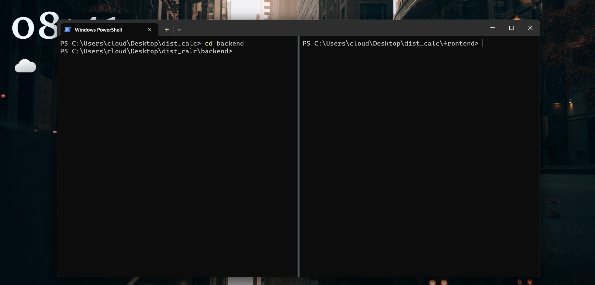
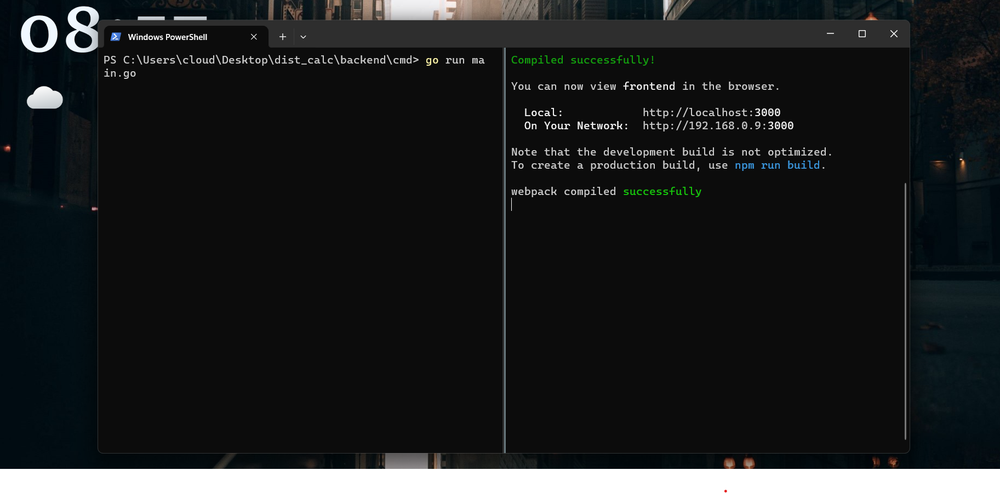
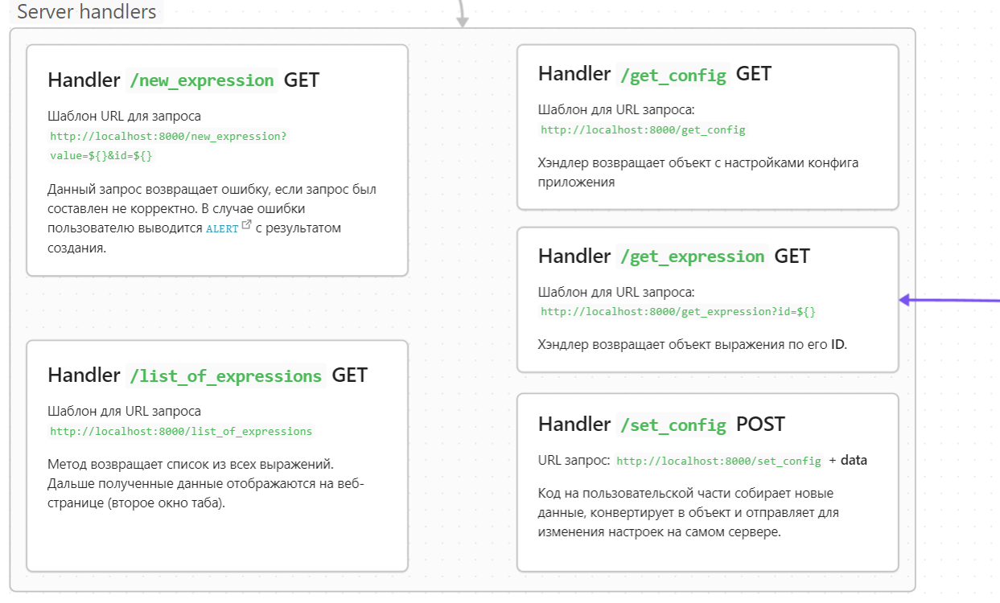
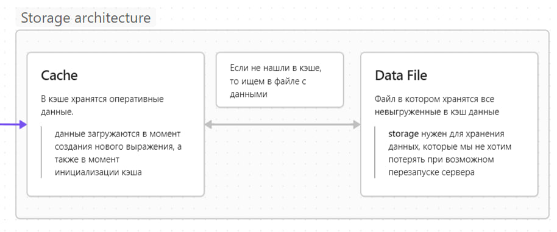
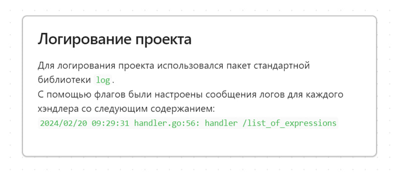

# Distributed Calculator

Проект Distributed Calculator - веб-приложение для создания и подсчета арифметических выражений. Творческое задание на курсе [Лицея Академии Яндекса](https://lyceum.yandex.ru/go)

По всем вопросам можно написать автору проекта - [Kuzmin Dmitry](https://t.me/kuzmindev)

**Стэк:** Golang + React JS

## Содержание

-   [Как запустить проект](#как-запустить-проект)
-   [Как устроен Frontend](#как-устроен-backend)
-   [Как устроен Frontend](#как-устроен-frontend)
-   [Полная схема устройства приложения](#полная-схема-проекта)

## Как запустить проект

Начнем запуск с клонирования репозитория c Github. Для этого откроем консоль и используя команду `cd` перейдем в папку рабочего стола. Выполним следующие команды:

```shell
mkdir dist_calc
cd dist_calc

git init
git pull https://github.com/ecol-master/Distributed-Calculator

tree
```

Команда `tree` выводит структуру проекта. После ее выполнения в консоли лолжно появиться следующее содержимое

```
├───backend
│   ├───cmd
│   ├───http
│   │   └───handler
│   └───pkg
│       ├───cache
│       ├───calculator
│       ├───config
│       ├───expression
│       ├───stack
│       └───storage
├───docs
│   └───schemas
└───frontend
    ├───public
    └───src
        ├───assets
        └───components
            ├───ConfigView
            ├───CreateExpression
            ├───Header
            ├───ListExpressions
            │   └───Expression
            └───Tabs
```

Далее, чтобы не потеряться в открытых окнах, я советую разделить окно терминала на две части. Сделать этого можно нажав правой кнопкой на вкладку терминала и выбрать действие **Split**



В левой вкладке перейдем в папку **backend**, в правой - **frontend**.

### Настройка backend'а

```shell
cd backend
mkdir data

cd cmd
go run main.go
```

Для работы приложения необходимо создать папку `data`, в которой будут храниться **log-файлы** и файл с данными об арифметических выражениях

### Настройка frontend'а

Пользовательская сторона приложения реализована на фреймворке **React**. Для его корректной работы и запуска нужно установить рантайм **NodeJS**. Если на вашем устройстве данного фреймворка нету, то установить **NodeJS** можно по [ссылке](https://nodejs.org/en/download) (Возможно, после установки придется перезапустить устройство)

Проверить, что все зависимость установлены, можно следующей командой. (Для выхода из появившегося окна нужно дважды нажать **Ctrl+C**)

```shell
node
```

Теперь будем выполнять команды в правой вкладке, для их выполнения вы уже должны находиться в каталоге **frontend** текущего репозитория:

```shell
npm i
npm start
```

Если у вас после выполения следующих команд появилось следующее состояние, то поздравляю, у вас запустился пользовательский интерфейс проекта.



**Примечание:** Если у вас установлена более раняя версия реакта, то во всех файлах с расширением `.jsx` нужно поменять импорты. Это связано с обновлениями самого фреймворка.
```js
// Вместо
import "react"

// Написать 
import React from "react"

````

## Как устроен Backend
Для работы серверной части мне понадобилось установить дополнительные библиотеки (насколько я знаю, в проектах на Go советуют обходиться средствами стандартной библиотеки). Данные решения понадобились мне для настройки **CORS** заголовков в проекте.
```txt
github.com/gorilla/handlers v1.5.2
github.com/gorilla/mux v1.8.1
````

### Handlers

Хэндлеры приложения и их функции.

В файле [server.go](./backend/http/server.go) происходит регистрация обработчиков.

В файле [handlers.go](./backend/http/handler/handler.go) реализованы хэндлеры.



### Storage

Все данные, к которым имеет доступ `storage` хранятся ли в обхект кэща, либо в файле `data/data.json`, в который выгружаются записи из кэша каждые 30 секунд. Такая система позволяет после перезапуска сервера не потерять уже посчитаннные выражения и показывать для пользователя спустя любое время работы.



### Логирование приложения

Для логирования проекта использовался пакет `log` из стандартной библиотеки. Основной логер настроен на вывод логов в ёфайл `info.log` в директории `data`. Также для логирования синхронизации между кэшем и стораджом использовался второй логер, который раз в 30 секунд сохраняет сообщения в файл `sync_storage.log`. Данный логер создается внутри функции, которая работает весь рантайм в фоне.



## Как устроен Frontend

На пользовательской части использовался `ReactJS`. Фреймворк для создания веб приложений. Я использовал его функционал на ~1%. Поскольку у меня был опыт создания двух серверов, сообщающихся между собой через **API** то я выбрал его. Хотя в моем мини-проекте можно было все генерировать через **html-templat'ы**, работу которых можно настроить с помощью сторонних модулей. Но зачем???

## Полная схема проекта

<!-- -->

